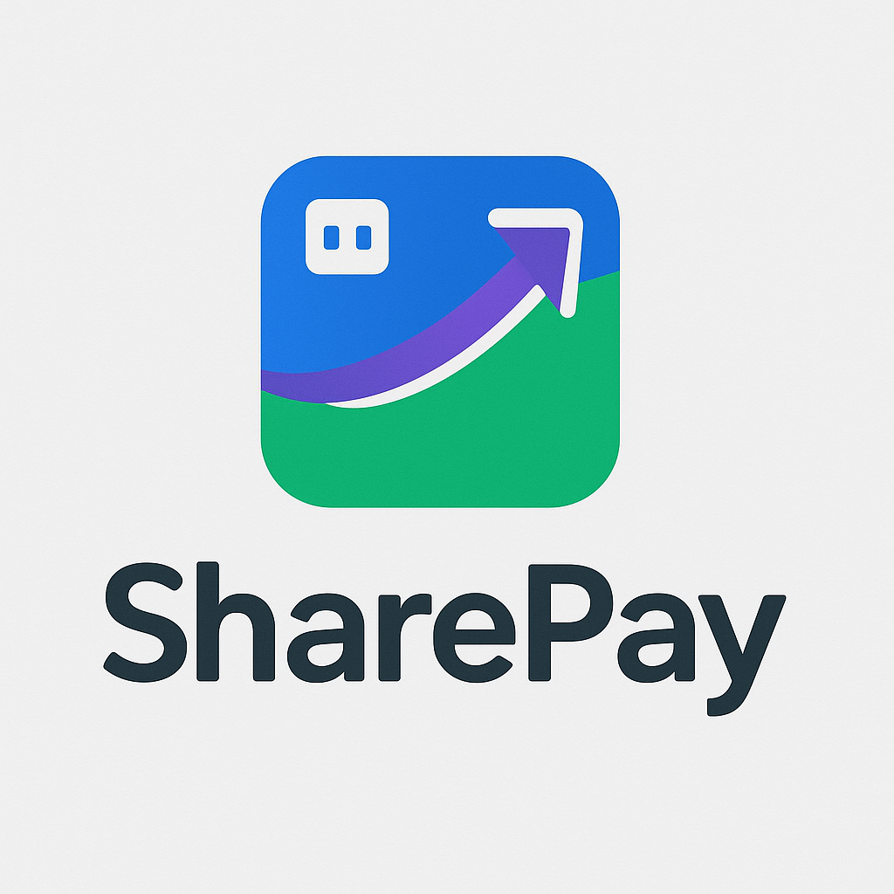
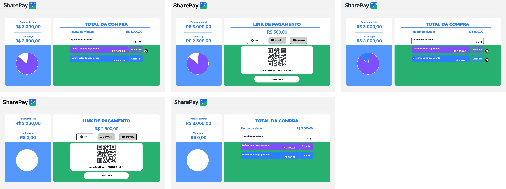

# 

## Proposta:
Sistema de pagamento que permite combinar múltiplas formas de pagamento (Pix + Cartão, 2 cartões, etc.) para uma única compra. Além disso, poderemos rastrear conexões entre pessoas, contas e dispositivos, detectando assim fraudes em rede (ex: triangulações, contas laranja)

## Exemplo de Fluxo:
1. Cliente vai ao checkout do e-commerce.
2. Clica em "Pagamento dividido".
3. Escolhe:
    -50% via Pix (gerar QR Code dinâmico).
    -50% no cartão (inserir dados).
4. Backend inicia ambas as cobranças:
5. Espera o pagamento do Pix ser confirmado.
6. Aguarda a aprovação do cartão.
7. Verifica a legitimidade do pagamento.
8. Quando ambos forem aprovados:
    -Finaliza pedido.
    -Gera comprovante unificado.
9. Se um pagamento falhar:
    -Possibilidade de reprocessar ou mudar a forma de pagamento.

---
### FIGMA: https://www.figma.com/design/PFT21kCIafLtFzxIgBwUaI/Untitled?node-id=0-1&m=dev&t=zm6ihgr0GrwCWNU3-1

# 

## 🧩 Estrutura do Grafo

### 🟢 NODES (Entidades principais)

| Label        | Atributos principais                           | Exemplo                          |
| ------------ | ---------------------------------------------- | -------------------------------- |
| `Order`      | `orderId`, `totalAmount`, `status`, timestamps | `123456`, `3000.00`              |
| `Payment`    | `paymentId`, `type`, `amount`, `status`, etc.  | `abc123`, `"card"`, `2500.00`    |
| `Payer`      | `name`, `email`, `document`, etc.              | `"Fulano"`, `"fulano@email.com"` |
| `Card`       | `cardLast4`, `network`, `bin`, etc.            | `"5678"`, `"Visa"`               |
| `PixAccount` | `bankCode`, `pixKey`, `accountNumber`          | `"0001"`, `"email@pix.com"`      |
| `Device`     | `ip`, `userAgent`, `geoLocation`               | `"192.168.0.1"`, `"Chrome"`      |

---

---
### 🔵 RELATIONSHIPS (Conexões)

| Relacionamento                          | Direção          | Exemplo                           |
| --------------------------------------- | ---------------- | --------------------------------- |
| `(:Payer)-[:MADE]->(:Payment)`          | →                | Pessoa realizou pagamento         |
| `(:Payment)-[:PART_OF]->(:Order)`       | →                | Pagamento parcial de um pedido    |
| `(:Payment)-[:USED_CARD]->(:Card)`      | →                | Relaciona cartão usado            |
| `(:Payment)-[:FROM_PIX]->(:PixAccount)` | →                | Origem do Pix                     |
| `(:Payer)-[:USED_DEVICE]->(:Device)`    | →                | IP/dispositivo do pagador         |
| `(:Payer)-[:SHARED_WITH]->(:Payer)`     | ↔ (bidirecional) | Detectado relacionamento indireto |

---

```plaintext
(Payer:Beltrano) 
   └──[:MADE]──> (Payment:card-123)
                       └──[:PART_OF]──> (Order:1234)
                       └──[:USED_CARD]──> (Card:****5678)

(Payer:Fulano)
   └──[:MADE]──> (Payment:pix-456)
                       └──[:PART_OF]──> (Order:1234)
                       └──[:FROM_PIX]──> (PixAccount:pix@email.com)
```
